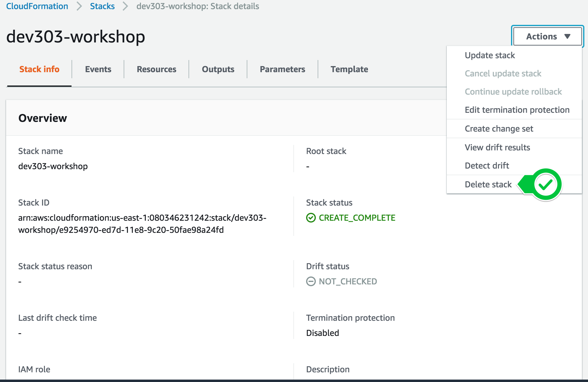

# Cleanup

Before deleting your Amazon EKS cluster make sure to remove any deployed applications because some of them will deploy ELBs that will bind to the VPC that was created which will cause the VPC deletion to fail.

## Cleaning up microservices

Delete the microservices and Kubernetes resources from your cluster:

```bash
kubectl delete -f deploy/monitoring
kubectl delete -f deploy/tracing
kubectl delete -f deploy/services
kubectl delete -f deploy/eks
```

## Cleaning up Metrics collection with Prometheus

Next, delete Prometheus and Grafana using helm:

```bash
helm delete prometheus
helm del --purge prometheus
helm delete grafana
helm del --purge grafana
```

## Cleaning up AWS resources

Detach IAM roles from the EKS worker node group IAM role. This needs to be done before removing the CloudFormation Stack.

```bash
# Get IAM instance profile
PROFILE=$(aws ec2 describe-instances --filters --filters Name=tag:Name,Values=dev303-workshop-0-Node --query 'Reservations[0].Instances[0].IamInstanceProfile.Arn' --output text | cut -d '/' -f 2)

# Get EKS worker node IAM role
ROLE=$(aws iam get-instance-profile --instance-profile-name $PROFILE --query "InstanceProfile.Roles[0].RoleName" --output text)

aws iam detach-role-policy --role-name $ROLE --policy-arn arn:aws:iam::aws:policy/AWSXRayDaemonWriteAccess # Detach X-Ray policy

ARN=$(aws iam list-policies --scope Local --query "Policies[?PolicyName=='Fluentd-Policy'].Arn" --output text)
aws iam detach-role-policy --role-name $ROLE --policy-arn $ARN # Detach Fluentd policy

# Detach Catalogservice and Orderservice policies
ARN=$(aws iam list-policies --scope Local --query "Policies[?PolicyName=='CatalogserviceDDB-Policy'].Arn" --output text)
aws iam detach-role-policy --role-name $ROLE --policy-arn $ARN

ARN=$(aws iam list-policies --scope Local --query "Policies[?PolicyName=='OrderserviceSQS-Policy'].Arn" --output text)
aws iam detach-role-policy --role-name $ROLE --policy-arn $ARN
```

Delete the **CloudFormation Stack**. Switch to the CloudFormation console, select the Stack and click **Delete Stack**



Delete the EKS cluster

```
eksctl delete cluster --name dev303-workshop --region us-west-2
```

As last step delete the Cloud9 environment. Go to the Cloud9 dashboard (not the IDE) and remove the environment.

The cleanup process is now complete.