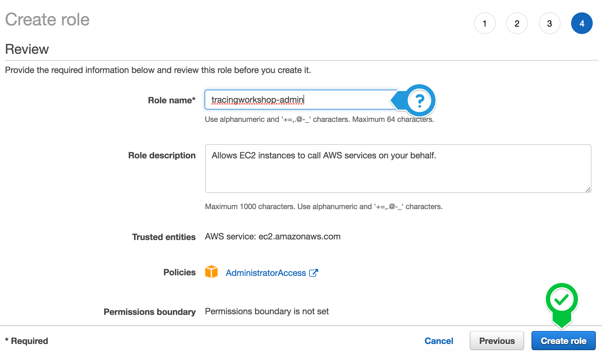
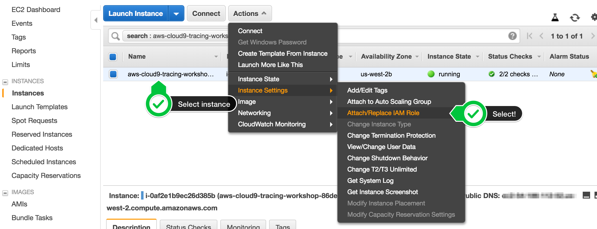
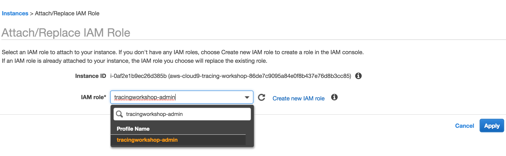

## Cloud9 Setup

> Ad blockers, javascript disablers, and tracking blockers should be disabled for
> the cloud9 domain, or connecting to the workspace might be impacted.
>
> Make sure to actually copy values from the Cloud9 terminal, as there is no copy-on-select!

- Create a [Cloud9 Environment](https://us-west-2.console.aws.amazon.com/cloud9/home?region=us-west-2)
  - Select **Create environment**
- Name it **tracingworkshop**, and take all other defaults
- When it comes up, customize the environment by closing the **Welcome tab**
  and **Lower work area**, and opening a new **Terminal** tab in the main work area:
  

- Your workspace should now look like this:
  


## Set up Cloud9 IAM permissions
1. Follow [this deep link to create an IAM role with Administrator access.](https://console.aws.amazon.com/iam/home#/roles$new?step=review&commonUseCase=EC2%2BEC2&selectedUseCase=EC2&policies=arn:aws:iam::aws:policy%2FAdministratorAccess)
2. Confirm that **AWS service** and **EC2** are selected, then click **Next** to view permissions.
3. Confirm that **AdministratorAccess** is checked, then click **Next** to review.
4. Enter **tracingworkshop-admin** for the Name, and select **Create Role**


1. Follow [this deep link to find your Cloud9 EC2 instance](https://console.aws.amazon.com/ec2/v2/home?#Instances:tag:Name=aws-cloud9-tracingworkshop*;sort=desc:launchTime)
1. Select the instance, then choose **Actions / Instance Settings / Attach/Replace IAM Role**

1. Choose **tracingworkshop-admin** from the **IAM Role** drop down, and select **Apply**


>Cloud9 normally manages IAM credentials dynamically. This isn't currently compatible with
>the aws-iam-authenticator plugin, so we will disable it and rely on the IAM role instead.

- Return to your workspace and click the sprocket, or launch a new tab to open the Preferences tab
- Select **AWS SETTINGS**
- Turn off **AWS managed temporary credentials**
- Close the Preferences tab


- To ensure temporary credentials aren't already in place we will also remove
any existing credentials file:
```
rm -vf ${HOME}/.aws/credentials
```

- We should configure our aws cli with our current region as default:
```
export AWS_REGION="us-west-2"
echo "export AWS_REGION=${AWS_REGION}" >> ~/.bash_profile
aws configure set default.region ${AWS_REGION}
aws configure get default.region
```

# Install Tools

The necessary tooling can be installed using a script. Run:

```bash
curl -sSL https://s3.amazonaws.com/aws-tracing-workshop-artifacts/install-tools.sh | bash -s stable
```

This will install all required tools and download the Github repository.

# Next Step

Back to [Prerequisites](prerequisites.md)


# *Optional! - Manual Installation in Cloud9*

As reference information, the necessary steps to install all required tools into the Cloud9 environment are listed below.

## *AWS CLI*

> For this workshop, please ignore warnings about the version of pip being used.

Run the following command to view the current version of aws-cli:

```
aws --version
```

Update to the latest version:

```
pip install --user --upgrade awscli
```

Confirm you have a newer version:

```
aws --version
```

## *Fetch sourcecode*

Clone the Github repository

```
cd ~/environment
git clone https://github.com/aws-samples/reinvent2018-dev303-code
```

## *Install Kubernetes tooling*

> Cloud9 is backed by a Linux instance, therefore we will give you the commands to download the Linux binaries. If you are running Mac OSX / Windows, please [see the official EKS docs for the download links.](https://docs.aws.amazon.com/eks/latest/userguide/getting-started.html)

Amazon EKS clusters require kubectl and kubelet binaries and the aws-iam-authenticator
binary to allow IAM authentication for your Kubernetes cluster.

### *Create the default ~/.kube directory for kubectl configuration*
```
mkdir -p ~/.kube
```

### *Install kubectl*
```
sudo curl --silent --location -o /usr/local/bin/kubectl "https://amazon-eks.s3-us-west-2.amazonaws.com/1.10.3/2018-07-26/bin/linux/amd64/kubectl"
sudo chmod +x /usr/local/bin/kubectl
```

### *Install AWS IAM Authenticator*
```
go get -u -v github.com/kubernetes-sigs/aws-iam-authenticator/cmd/aws-iam-authenticator
sudo mv ~/go/bin/aws-iam-authenticator /usr/local/bin/aws-iam-authenticator
```

### *Verify installation*
To verify that both tools are installed successfully run the commands

```
kubectl version --short --client
aws-iam-authenticator help
```

## *Install eksctl*
Install eksctl per instructions from [eksctl.io](https://eksctl.io)

```bash
curl --silent --location "https://github.com/weaveworks/eksctl/releases/download/latest_release/eksctl_$(uname -s)_amd64.tar.gz" | tar xz -C /tmp
sudo mv /tmp/eksctl /usr/local/bin
```

### *Verify installation*

Confirm your eksctl version is at least `0.1.11` with the command
```bash
eksctl version
```

### *Create SSH Key*

By default **eksctl** uses the **~/.ssh/id_rsa** SSH key. If this does not exist on your machine you can create it with 

```bash
ssh-keygen
```

Press enter 3 times to generate the key. This key is necessary if you want to log in to the EKS worker nodes.

## *Install Docker*

For the Cloud9 environment, Docker is already pre-installed.

```
docker --version
```