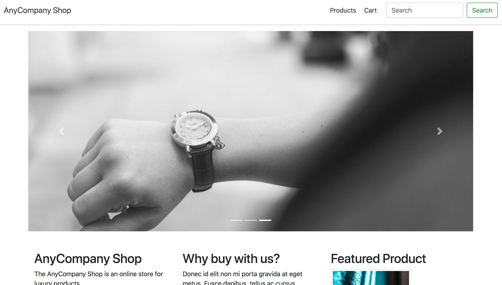

# Lab 1 - Create EKS cluster and demo application

## Create an Amazon EKS Cluster

> **Note**
>
> Double check that the required tooling is installed before creating a cluster. You need to have the AWS CLI installed and configured and `kubectl` must is installed as well.

Use the following command to create your **EKS** cluster **without** adding ssh keys for access to the worker nodes (ssh access is not required to complete the workshop!):

```bash
eksctl create cluster \
--name dev303-workshop \
--region us-west-2 \
--managed \
--nodes=4
```

**Advanced** Use the following command to create your **EKS** cluster **adding** ssh keys for access to the worker nodes (first generate your ssh keypair if not done already):

```bash
eksctl create cluster \
--name dev303-workshop \
--region us-west-2 \
--managed \
--nodes=4 \
--ssh-access --ssh-public-key=myid_rsa_ssh_key.pub
```

This will create a cluster in the us-west-2 (Oregon) region with 4 x m5.large instances.

> **Note**
> 
> Launching the EKS control plane and worker nodes will take approximately 15 minutes

After **eksctl** successfully created the cluster, check if the worker nodes are online and kubectl is working. Run 
```
kubectl get nodes
```

and you should see a list of nodes:

```bash
$ kubectl get nodes
NAME                                           STATUS    ROLES     AGE       VERSION
ip-192-168-29-95.us-west-2.compute.internal    Ready     <none>    2m        v1.10.3
ip-192-168-62-87.us-west-2.compute.internal    Ready     <none>    2m        v1.10.3
ip-192-168-70-32.us-west-2.compute.internal    Ready     <none>    2m        v1.10.3
ip-192-168-74-223.us-west-2.compute.internal   Ready     <none>    2m        v1.10.3
```

## Deploy "AnyCompany Shop" microservices application

Follow the steps described next to prepare your environment for the application deployment.

### Deploy application prerequisites

First, deploy the definitions to prepare the environment. This step creates a Kubernetes **namespace** for the microservices and configures the **environment**.

> **Note**
>
> If you are not deploying to the *us-west-2* region you need to update the AWS_REGION variable in the following file `deploy/eks/prep.yaml` to point to the region used.

```
kubectl create -f deploy/eks/prep.yaml
```
> For demo purposes some values are pre-generated. Replace them with your own, base64 encoded, values to improve security.

### Prepare and deploy credentials

Attach the necessary IAM policies to the worker nodes. This will enable containers running on these nodes to access AWS resources. Two of the services you will deploy in the next step are making use of this to access DynamoDB and SQS.
```bash

# Get the nodegroup (assuming there is only 1 nodegroup at this point)
NODEGROUP=$(eksctl get nodegroups --cluster=dev303-workshop | awk '{print $2}' | tail -n1)

# Get EKS worker node IAM instance role ARN
PROFILE=$(aws ec2 describe-instances --filters Name=tag:Name,Values=dev303-workshop-$NODEGROUP-Node --query 'Reservations[0].Instances[0].IamInstanceProfile.Arn' --output text | cut -d '/' -f 2)

# Fetch IAM instance role name
ROLE=$(aws iam get-instance-profile --instance-profile-name $PROFILE --query "InstanceProfile.Roles[0].RoleName" --output text)

echo $ROLE # Print role name

# Attach IAM policy for Orderservice
ARN=$(aws iam list-policies --scope Local --query "Policies[?PolicyName=='OrderserviceSQS-Policy'].Arn" --output text)
echo $ARN
aws iam attach-role-policy --role-name $ROLE --policy-arn $ARN

# Attach IAM poliy for Catalogservice
ARN=$(aws iam list-policies --scope Local --query "Policies[?PolicyName=='CatalogserviceDDB-Policy'].Arn" --output text)
echo $ARN
aws iam attach-role-policy --role-name $ROLE --policy-arn $ARN
```

> In a production setup this is **discouraged**. Please use a solution that will fetch temporary credentials for each Pod via IAM and STS.

### Deploy "AnyCompany Shop"

Deploy the eCommerce microservice application to the cluster
```
kubectl create -f deploy/services
```

If everything worked the list of **Pods** in your Amazon EKS cluster should look like this.

```bash
$ kubectl get pods -n microservices-aws
NAME                                       READY   STATUS    RESTARTS   AGE
cartservice-9d5b5db6-2v2t2                 1/1     Running   0          1d
cartservice-9d5b5db6-4hzzj                 1/1     Running   0          1d
catalogservice-74d8fbd66c-7g6k9            1/1     Running   0          1d
catalogservice-74d8fbd66c-wtmtl            1/1     Running   0          1d
frontend-f56974449-695h2                   1/1     Running   0          1d
frontend-f56974449-lnw58                   1/1     Running   0          1d
imageservice-698fb47d49-7gswx              1/1     Running   0          1d
imageservice-698fb47d49-dg4cc              1/1     Running   0          1d
loadgen-6d9c75f66b-sp5cq                   1/1     Running   0          1d
orderservice-7dc7bcbc66-fkfr2              1/1     Running   0          1d
orderservice-7dc7bcbc66-fzgr4              1/1     Running   0          1d
recommenderservice-8bbb5fb66-2425f         1/1     Running   0          1d
recommenderservice-8bbb5fb66-8bcsr         1/1     Running   0          1d
redis-58b5b5d5d4-94fpf                     1/1     Running   0          1d
```

For each microservice, 2 replicas are running. An instance of Redis is online for session and cart storage. The *loadgen* Pod is generating traffic to simplify the next two labs.

### Get Frontend endpoint

Get Frontend SVC Url with the following command 
```
kubectl get svc -o jsonpath='{.items[?(@.metadata.name == "frontend-external")].status.loadBalancer.ingress[0].hostname}' -n microservices-aws
```

Copy the URL into your browser and explore the "AnyCompany Shop". Add a product to your cart and proceed to checkout.



The installation of the "AnyCompany Shop" microservices demo application is now complete.

# Next Step

Continue to [**Lab 2**](lab2.md)
