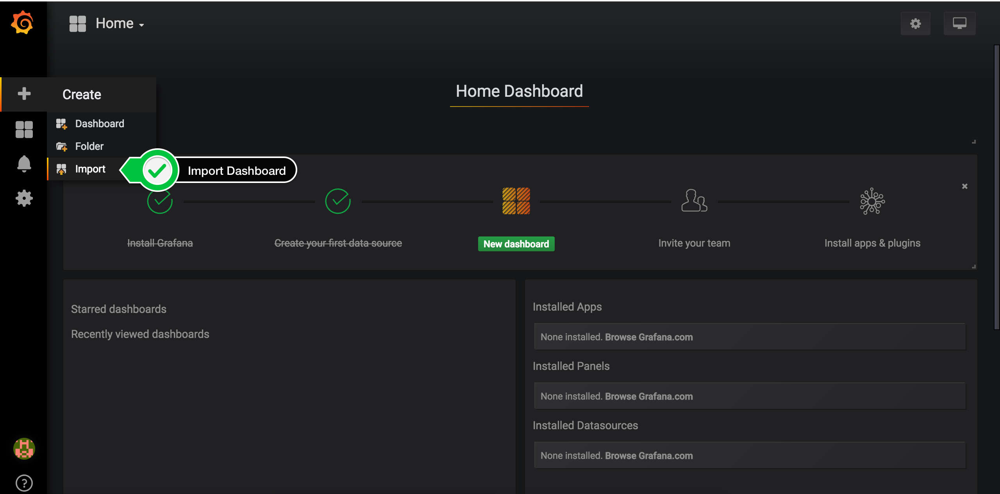
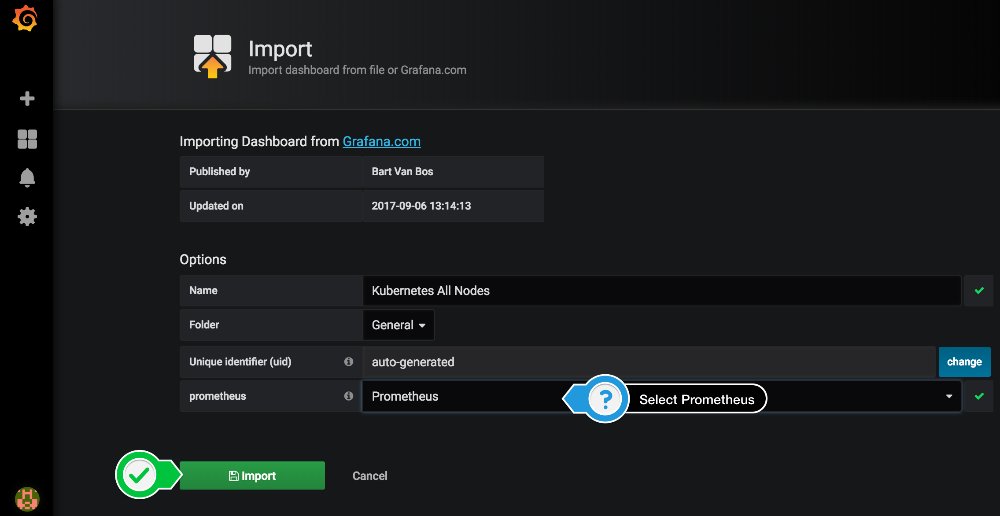

# Lab 2 - Observability for Amazon EKS

Access to log information from the containers that were deployed to your Amazon EKS cluster is an important part to achieve observability for your applications.

In this lab, you will be using CloudWatch Logs to monitor the logs of your containers and Prometheus/Grafana to monitor metrics.

## Using Amazon CloudWatch Container Insights
Please follow the instructions in the CloudWatch Container Insights documentation at https://docs.aws.amazon.com/AmazonCloudWatch/latest/monitoring/deploy-container-insights-EKS.html
to set up the necessary permissions for your worker nodes, set up CWAgent daemonset and add Fluentd daemonset to your EKS cluster.

Afterwards head to the Amazon CloudWatch console [CloudWatch Container Insights console](https://console.aws.amazon.com/cloudwatch/home#cw:dashboard=Container;context=~(clusters~(~)~dimensions~(~)~performanceType~'ClusterName)) and view metrics for your cluster. You can switch to CloudWatch Logs Insights to view the logs for each individual Pod directly from this dashboard.

***
## Previous Instructions

Recommended approach is to use Amazon CloudWatch Container Insights. If you still like to run Prometheus, Grafana see instructions below.

## Collecting logs using `FluentBit`
Deploy Fluentd as a Daemonset to collect logs and send them to CloudWatch Logs. Full instructions are documented here [Centralized container logging with FluentBit](https://aws.amazon.com/blogs/opensource/centralized-container-logging-fluent-bit/) for EKS and ECS.

## Health and Performance Monitoring

To monitor the health of your applications it is also necessary to gather metrics for the applications.

To do this we will use Prometheus which can automatically detect and monitor applications running within an Amazon EKS cluster.

### Installing `helm`

We will use **helm** to install Prometheus & Grafana monitoring tools for this chapter.

[Helm](https://helm.sh/) is a tool that streamlines installing and managing Kubernetes applications. Think of it like apt/yum/homebrew for Kubernetes. With helm, you deploy Charts, which are packages of pre-configured Kubernetes resources.

Make sure that helm is installed by running
```bash
helm version --client

# Should output something like this
Client: &version.Version{SemVer:"v2.11.0", GitCommit:"2e55dbe1fdb5fdb96b75ff144a339489417b146b", GitTreeState:"clean"}
```

<details><summary>Installing helm manually</summary>
<p>

If helm is not already installed, run
```bash
# Install helm
curl "https://raw.githubusercontent.com/kubernetes/helm/master/scripts/get" > get_helm.sh
chmod +x get_helm.sh
./get_helm.sh
```

</p>
</details>

**Helm** needs to be added to your Amazon EKS cluster. Run the following commands to set up the **helm** cluster component - named *tiller* - on your cluster.

```bash
# Create service account
kubectl -n kube-system create serviceaccount tiller

# Create cluster wide role binding
kubectl create clusterrolebinding tiller --clusterrole cluster-admin --serviceaccount=kube-system:tiller

# Init helm with service account from above
helm init --service-account=tiller
```

Wait a few seconds for *tiller* to become ready, then check if 
```
helm ls
```
works. This should not return any output when successful. (You can check the status code with `echo $?`)

### Deploy Prometheus

[Prometheus](https://prometheus.io) is an open-source monitoring system with a dimensional data model, flexible query language, efficient time series database, and modern alerting approach.

Deploy Prometheus to your cluster

```bash
helm install -f deploy/prometheus/prometheus-values.yaml stable/prometheus --name prometheus --namespace prometheus
```

The values have been adapted for this workshop and should not require any changes. Feel free to take a look at `deploy/prometheus/prometheus-values.yaml` to see how it is configured.

### Deploy Grafana

Deploy Grafana to your cluster

```bash
helm install -f deploy/prometheus/grafana-values.yaml stable/grafana --name grafana --namespace grafana
```

The values have been adapted for this workshop and should not require any changes. The Prometheus endpoint is already configured to connect to the Prometheus deployed in the previous step. Feel free to take a look at `deploy/prometheus/grafana-values.yaml` to see how it is configured.

Run the command to check if Grafana is running properly

```bash
kubectl get all -n grafana
```

You can get Grafana ELB URL using this command. Copy & Paste the returned URL into a browser to access Grafana Web UI.

```bash
kubectl get svc -n grafana grafana -o jsonpath='{.status.loadBalancer.ingress[0].hostname}'
```

Log in with **Username: admin** and **Password LasVegas!**

### Create Dashboards

You will notice that **Install Grafana** & **Create your first data source** are already completed. We will import community created dashboards for this workshop.

Click '**+**' button on the left panel and select **Import**



Paste the **JSON** contents from the file `deploy/monitoring/cluster-dashboard.json` into the input field.

Leave the defaults, select **'Prometheus'** as the endpoint under prometheus data sources drop down, click **'Import'**.



This will show a monitoring dashboard for all cluster nodes.

To create a dashboard to monitor all pods, repeat the same process as above and paste the **JSON** contents from the file `deploy/monitoring/pod-dashboard.json` into the input field.

# Next Step

Continue to [**Lab 3**](lab3.md)