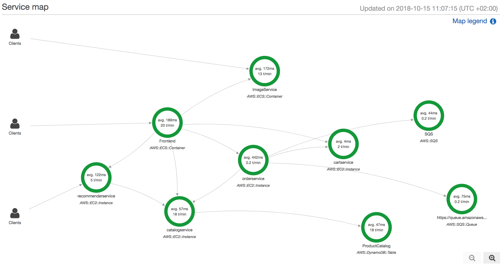
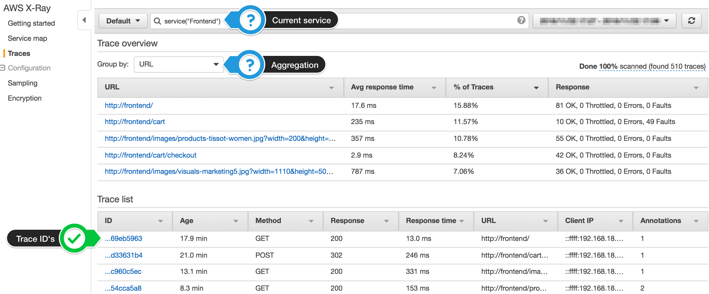
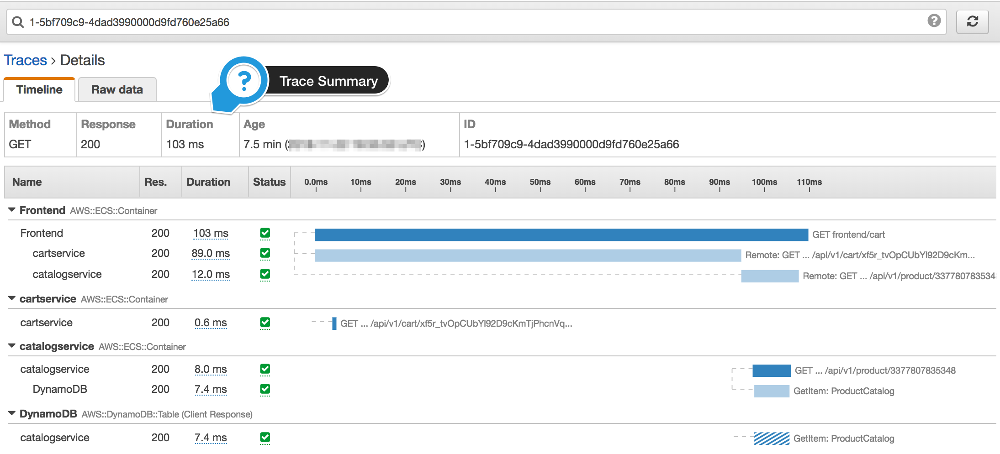
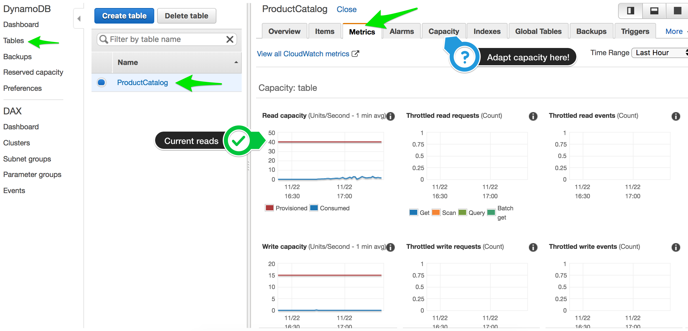

# Lab 3 - Distributed Tracing with AWS X-Ray

As distributed systems evolve, monitoring and debugging services becomes challenging. Container-orchestration platforms like Kubernetes solve a lot of problems, but they also introduce new challenges for developers and operators in understanding how services interact and where latency exists. [AWS X-Ray](https://aws.amazon.com/xray/) helps developers analyze and debug distributed services.

In this module, we are going to deploy the [X-Ray agent](https://docs.aws.amazon.com/xray/latest/devguide/xray-daemon.html) as a [DaemonSet](https://kubernetes.io/docs/concepts/workloads/controllers/daemonset/), instrument the eCommerce services with the [X-Ray SDK](https://docs.aws.amazon.com/xray/index.html#lang/en_us), make some sample requests and then examine the traces and service maps in the AWS Management Console.


## Installing AWS X-Ray

### IAM permissions for worker nodes

Before we can deploy the AWS X-Ray daemon to the EKS cluster we need to apply the necessary IAM permissions. Attach the `AWSXRayDaemonWriteAccess` policy to the node group created by eksctl. This allows the X-Ray Pods on any worker node to send trace data to the AWS X-Ray backend. 

Find the name of your EKS **worker node group** and attach the **X-Ray IAM policy** to the worker nodes **IAM role**.

```bash
# Get the nodegroup (assuming there is only 1 nodegroup at this point)
NODEGROUP=$(eksctl get nodegroups --cluster=dev303-workshop | awk '{print $2}' | tail -n1)

# Get EKS worker node IAM instance role ARN
PROFILE=$(aws ec2 describe-instances --filters Name=tag:Name,Values=dev303-workshop-$NODEGROUP-Node --query 'Reservations[0].Instances[0].IamInstanceProfile.Arn' --output text | cut -d '/' -f 2)

ROLE=$(aws iam get-instance-profile --instance-profile-name $PROFILE --query "InstanceProfile.Roles[0].RoleName" --output text)

echo $ROLE

# Attach IAM policy to enable AWS X-Ray access
aws iam attach-role-policy --role-name $ROLE --policy-arn arn:aws:iam::aws:policy/AWSXRayDaemonWriteAccess
```

### Deploy AWS X-Ray daemonset
Now we are ready to deploy the X-Ray daemon itself. The X-Ray daemon will be deployed to each worker node in the EKS cluster.

To deploy the X-Ray **DaemonSet** to the Amazon EKS cluster.

```
kubectl apply -f deploy/tracing/
```

The X-Ray daemon will be deployed to the `kube-system` namespace, so run 

```
kubectl get pods -l app=xray-daemon -n kube-system
```

This should print something similar to

```
NAME                READY   STATUS    RESTARTS   AGE
xray-daemon-767bx   1/1     Running   0          4d
xray-daemon-f6hdp   1/1     Running   0          4d
xray-daemon-lxt7n   1/1     Running   0          4d
```

Your Amazon EKS cluster is now ready to send traces from applications to AWS X-Ray

## Adding X-Ray to the microservices

To send traces to AWS X-Ray the applications need the required instrumentation in the code to send traces via X-Ray daemon to AWS X-Ray.

There are two options here

- a) Use pre-built container images (*Easy*)
- b) Instrument the application code yourself (*Informative*)

Choose your approach and continue with one of the two sections below.

## a) Using pre-built containers (*Easy*)
You can use **pre-built** container images with all the necessary instrumentation enabled and switch the image used for any of the services to use these.

To update *all* container images use

```bash
for n in cartservice catalogservice frontend imageservice orderservice recommenderservice
do
    echo "Updating $n"
    kubectl set image deployment/$n $n=ckassen/$n\:xray -n microservices-aws
done
```

## b) Instrumenting application code (*Informative*)

The following code snippets show example code necessary to instrument the "AnyCompany Shop" services with AWS X-Ray instrumentation code.

### Sample code Node.js example
```javascript
//Add aws-xray-sdk package to package.json

const AWSXRay = require('aws-xray-sdk');
AWSXRay.config([AWSXRay.plugins.EC2Plugin,AWSXRay.plugins.ECSPlugin]);
const xrayExpress = require('aws-xray-sdk-express');

app.use(xrayExpress.openSegment('Frontend'));

app.get('/', function(req, res){})

app.use(xrayExpress.closeSegment());
```

### Python example
```python
from aws_xray_sdk.core import xray_recorder, patch_all
from aws_xray_sdk.ext.flask.middleware import XRayMiddleware

plugins = ('EC2Plugin', 'ECSPlugin') # Plugins

# Configure recorder
xray_recorder.configure(service='recommenderservice',plugins=plugins)

# Add Xray middleware to Flask app
XRayMiddleware(app, xray_recorder)

# Patch clients, SDK‘s such as boto3, requests, ...
patch_all()
```

Use the following resources to learn more about the capabilities of the AWS X-Ray SDK's and how to instrument application code. Afterward you should be able to add the necessary **instrumentation** to the services.

- [AWS X-Ray Python SDK](https://docs.aws.amazon.com/xray/latest/devguide/xray-sdk-python.html) / [SDK on Github](https://github.com/aws/aws-xray-sdk-python)
- [AWS X-Ray Node.js SDK](https://docs.aws.amazon.com/xray/latest/devguide/xray-sdk-nodejs.html) / [SDK on Github](https://github.com/aws/aws-xray-sdk-node)

After you add the required instrumentation code **re-build** the Docker image and **push** it up into the **container registry** of your choice.

See [Container Repos](container-repos.md) for guideance on how to create your own container repositories to host the updated container images.

Afterward update the Kubernetes deployment specification of the service to use the newly built container image from your registry.

```bash
# Update catalogservice deployment
kubectl set image deployment/catalogservice catalogservice=<yourregistry>/catalogservice:<your tag> -n microservices-aws
```

Repeat the steps for all 6 services to achieve complete **observability** across all services.

Run

```
kubectl get pods -n microservices-aws
```

and check if all Pods are still running without errors.

## Understanding traces

Reload the website in your browser a few times and browse around the eCommerce storefront. These requests and the background load generator, that you deployed in Lab 1,  will generate request traces, which are sent to AWS X-Ray.

Afterward you can **log in** to the AWS console and switch to the [**AWS X-Ray console**](https://console.aws.amazon.com/xray/home#/service-map).

> **Note**
> The X-Ray console may start with a first run experience. Click **Get Started** and then **Cancel** the wizard directly afterward and you will be redirected to the service map.

The service map auto-updates so if not all services are visible immediately just wait a bit and keep browsing around in the sample application.

After a couple of minutes the service map should look something like this:



The [Service map in the console](https://console.aws.amazon.com/xray/home#/service-map) provides a visual representation of the steps identified by X-Ray for a particular trace. Each resource that sends data to X-Ray within the same context appears as a service in the graph. In the example above, we can see that the **Frontend** service is processing 20 transactions per minute with an average latency of 189ms per operation. Additionally, the **Catalogservice** is showing an average latency of 57ms per transaction.

Next, go to the [traces section in the AWS Management Console](https://console.aws.amazon.com/xray/home#/traces) to view the execution times for the segments in the requests. At the top of the page, we can see the URL for the endpoint and the corresponding traces below. You can also select different **Group by** aggregations.



If you click on the link on the left in the **Trace list** section you will see the overall execution time for the request (13ms for the **Frontend** which wraps other segments and subsegments), as well as a breakdown of the individual [segments](https://docs.aws.amazon.com/xray/latest/devguide/xray-concepts.html#xray-concepts-segments) in the request. In this visualization, you can see the Frontend segment and Cartservice, Catalogservice and DynamoDB [subsegments](https://docs.aws.amazon.com/xray/latest/devguide/xray-concepts.html#xray-concepts-subsegments). For each subsegment you see how much time was spent inside the individual service processing the request.



Dig into the different **Traces**, go back to the **Service Map** and select a different service and see how the Traces capture the overall request as it was processed by different microservices.

**Congratulations! You have successfully enabled distributed tracing!**

## Adding Chaos
To see how AWS X-Ray helps understand end user impact you can deploy a **chaos generation service** to your Amazon EKS cluster.

Run
```
kubectl apply -f deploy/eks/randomizer.yaml
```
to deploy a Pod that will randomly kill one of the services, which are part of the eCommerce application. Every 2 - 5 Minutes a randomly selected service will be killed. The high frequency is by design to quickly visualize the impact via AWS X-Ray.

Kubernetes will detect the failure and will automatically re-spawn the container. Still, some requests will fail and end users will see an impact. This impact will be visible within AWS X-Ray.

To stop generating chaos within your application simply delete the generator with the command 
```
kubectl delete -f deploy/eks/randomizer.yaml
```

### Adapting DynamoDB capacity
To understand and visualize the effect of a slowly responding microservice you can adapt the DynamoDB capacity for the **ProductCatalog** table used by the `catalogservice`. Switch to **DynamoDB** within the *AWS Console* and select the **Capacity** tab. If you lower the capacity allocated to the DynamoDB table to a very low value you may see an impact in the AWS X-Ray traces quickly because DynamoDB will throttle some of the requests to the `ProductCatalog` table.



# What's Next?

Try experimenting with the different features of AWS X-Ray, such as **Grouping** and creating **Alarms** for X-Ray Groups in CloudWatch.

Afterward go ahead and add instrumentation to your own code and improve the **Observability** of your applications.

If you have ideas or additions to this workshop please open an [Issue](https://github.com/aws-samples/reinvent2018-dev303-code/issues) or [Pull-Request](https://github.com/aws-samples/reinvent2018-dev303-code/pulls) on Github. **Your feedback is welcome!**