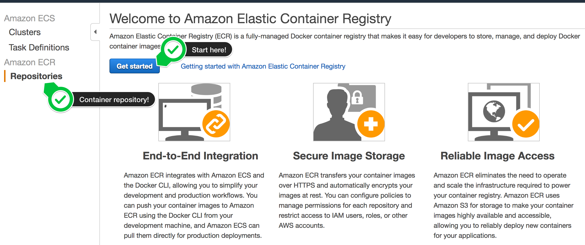
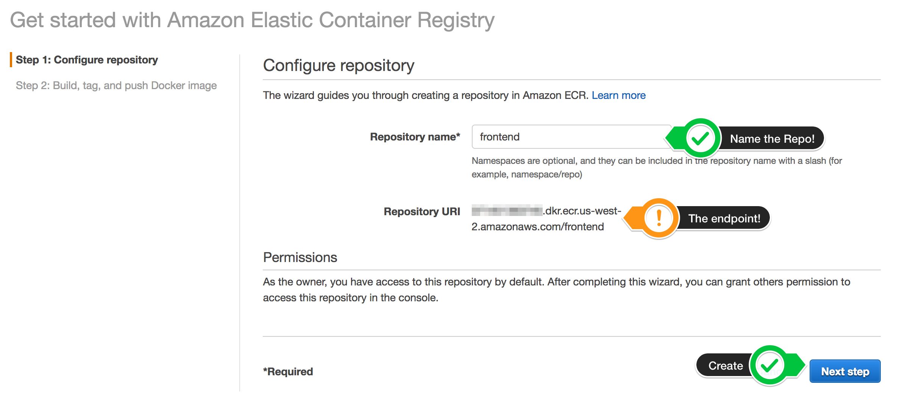
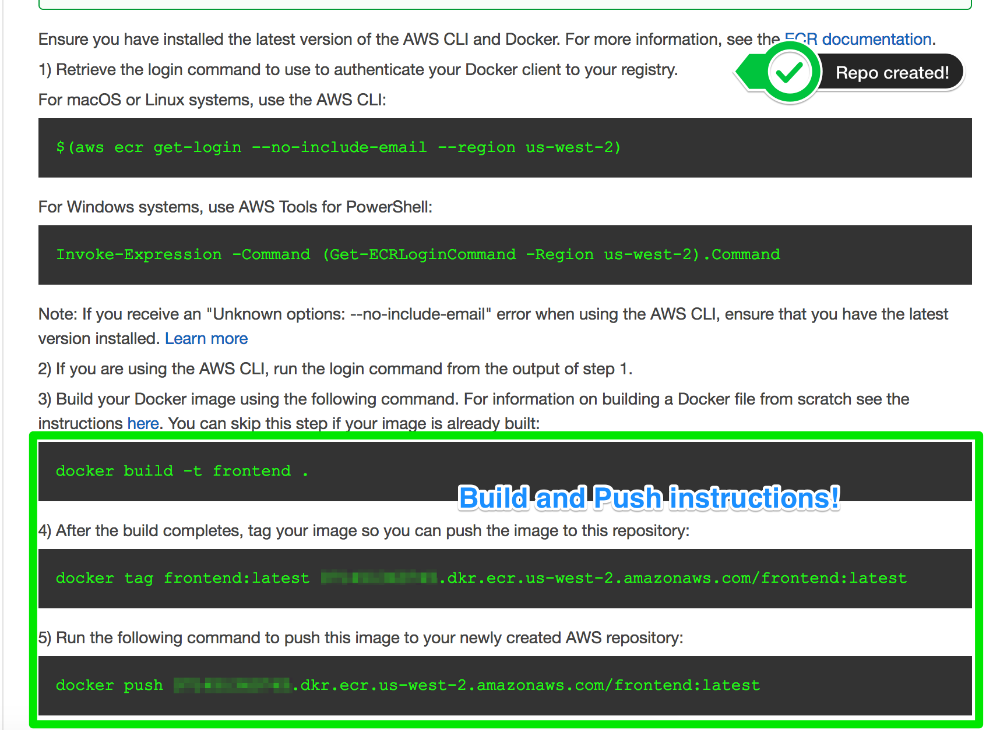

# Prerequisites

To simplify the initial setup this workshop recommends to use AWS Cloud9. The following instructions will guide you through the setup of Cloud9. If you like you can install the required tooling on your local machine and will still be able to accomplish the whole workshop.

## Log in to your AWS account
> Your account must have the ability to create new IAM roles and scope other IAM permissions.

Once you have logged in to your AWS account, ensure you are following the remaining workshop steps
as **IAM user** with **Administrator** access to the AWS account.

## Cloud9 Setup - *Recommended*

For a web-based setup follow the [Cloud9 setup](cloud9-mode.md) instructions. 

### Manual Setup - *Expert*

If you are comfortable installing tooling onto your local machine follow the [Manual Mode](manual-mode.md) instructions.


## Container Repositories
For every service that you want to modify you need to create a container repository which will host the modified container image. The two recommended options to host these images are Docker Hub and Amazon Elastic Container Registry.

### Docker Hub
Create an account on Docker Cloud so you can rebuild the container images and push them up to the registry. Your EKS cluster is able to pull these images from public Docker Hub repositories.

### Amazon Elastic Container Registry
Create repositories in the **Amazon Elastic Container Registry (ECR)** inside your AWS account. Follow the steps shown after creating each repository to build and push a container image to the repository. In the **AWS Console** switch to *Amazon ECS* to get to **ECR**



Then create a repository for each microservice. Provide a **Name** to create the repository. The **Repository URI** where Kubernetes will pull the container images from is shown as well.



After the repository is created you will see instructions on how to access the repository and how to build and push a container image to the repository.



We recommend creating a separate **ECR repository** for *each* microservice.

# *Developing - Optional*

## *Source Code Structure*

Open the code in your favorite text editor. The source code for all services is located at the `src/` directory.

```
./src
 |-- cartservice
 |-- catalogservice
 |-- frontend
 |-- imageservice
 |-- loadgen
 |-- orderservice
 |-- randomizer
 |-- recommenderservice
 `-- xray-daemon
```

 Configure **.env** files to export settings for each service. Copy the provided localdev.env files and name them .env. Every service is using a dotenv package to read these values and override the defaults.

## *Install dependencies for local development*

Install these dependencies if you would like to run the services locally to simplify development.

1. Install node.js
2. Install Python
3. Install pipenv
4. Install Redis

# Next Step

Continue to [**Lab 1**](lab1.md)

